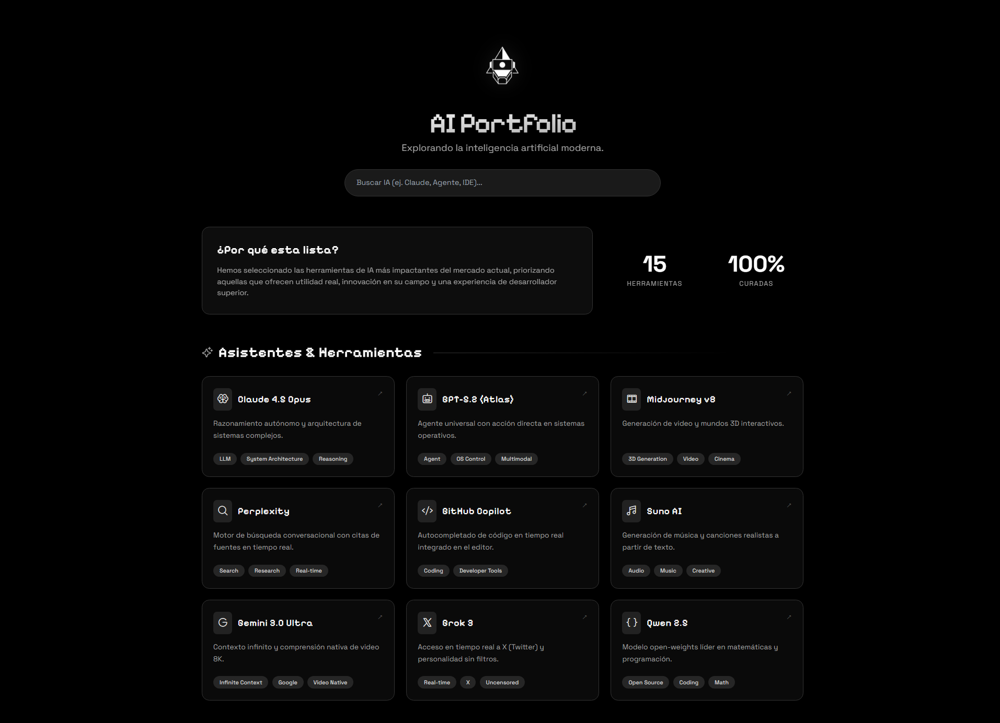

# AI Portfolio

A modern, high-performance Single Page Application (SPA) designed to curate and showcase next-generation Artificial Intelligence tools. Built with Angular 17+ and adhering to strict Clean Architecture principles for scalability, maintainability, and type safety.

## Project Overview

[](https://neural-vault-five.vercel.app/)

This application serves as a curated catalog of AI tools, featuring:

- Landing page with segmented categories (Autonomous Agents and AI-Powered IDEs)
- Infinite scrolling carousels powered by Swiper.js
- AI-powered search recommendations via Google Gemini
- Detailed views for each tool with specifications

## Architecture and Design Principles

The codebase follows a modular architecture that separates concerns distinctively:

- **Core Layer**: Contains business logic, data models, and stateless services. Data is isolated in dedicated configuration files to maintain purity in services.
- **Shared Layer**: Hosts reusable, presentation-only (dumb) components like cards, carousels, and footers that are agnostic to business logic.
- **Features Layer**: Manages smart components (pages) that orchestrate data flow and user interaction.

### Key Technical Features

- **Angular Standalone Components**: Elimination of NgModules for a streamlined development workflow and better tree-shaking.
- **Angular Signals**: Granular, reactive state management replacing complex RxJS streams for synchronous data flows.
- **Swiper.js Integration**: Touch-friendly, performant infinite carousels with autoplay and pause-on-hover.
- **Single Page Application (SPA)**: Robust client-side routing with component input binding and position restoration.
- **Tailwind CSS Integration**: Utility-first styling architecture configured with a custom design system (fluid typography, semantic colors, and animations).
- **Type Safety**: Strict TypeScript configuration forbidding the use of `any` and enforcing strong typing across all layers.
- **Accessibility**: Respects `prefers-reduced-motion` and `prefers-contrast` media queries.

## Technology Stack

| Category | Technology |
|----------|------------|
| Framework | Angular 17+ |
| Language | TypeScript 5.x |
| Styling | Tailwind CSS 3.4 |
| Carousel | Swiper.js 11 |
| Icons | Phosphor Icons |
| Fonts | Space Grotesk (Body), Pixelify Sans (Headings) |
| Package Manager | pnpm |

## Project Structure

```text
src/app/
├── core/                  # Essential business logic
│   ├── models/           # TypeScript interfaces and types
│   └── services/         # State management and API communication
├── shared/                # Reusable UI components
│   └── components/
│       ├── ai-card/      # Tool display card
│       ├── footer/       # Site footer
│       └── infinite-carousel/  # Swiper-based carousel
└── features/              # Route-level smart components
    ├── home/             # Main landing page with carousels
    └── ai-detail/        # Dynamic tool detail view
```

## Installation and Development

### Prerequisites

- Node.js 18+
- pnpm

### Setup

1. **Install Dependencies**:
   ```bash
   pnpm install
   ```

2. **Environment Configuration**:
   Copy the example environment file and configure your variables:
   ```bash
   cp .env.example .env
   ```
   Edit `.env` to set your API URL:
   ```env
   NG_APP_API_URL=http://localhost:8080/api
   ```

3. **Start Development Server**:
   ```bash
   pnpm start
   ```
   The application will be available at `http://localhost:4200/`.

4. **Build for Production**:
   ```bash
   pnpm build
   ```
   The build artifacts will be stored in the `dist/` directory.

## Backend Integration

This frontend connects to a Spring Boot backend (`neural-vault-api`) which provides:

- RESTful API for tool catalog (`/api/tools`)
- AI-powered recommendations via Google Gemini (`/api/recommendations`)
- In-memory H2 database with seeded data

Ensure the backend is running before starting the frontend for full functionality.

## License

This project is open source and available under the MIT License.
